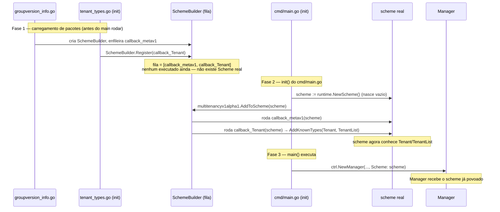

# Notas de aprendizado — TenantForge

Registro do que foi estudado montando o operator, sessão a sessão. Serve de referência rápida e de matéria-prima pro capítulo de fundamentação teórica do TCC.

## 1. O problema e o porquê do projeto

TenantForge é um operator de multi-tenancy: um CRD `Tenant` que abstrai NetworkPolicy, ResourceQuota, LimitRange e RBAC por trás de um schema simples, pra times sem bagagem de k8s conseguirem operar com segurança.

**Estado da arte (importante pra defesa):**
- **Capsule** (CNCF, clastix.io) — já faz algo muito parecido: CRD `Tenant` agrupando namespaces sob RBAC/NetworkPolicy/Quota compartilhados. Mas é **configurável por quem já manja** (você escreve os valores reais).
- **HNC** (Hierarchical Namespace Controller) — **arquivado/aposentado em abril de 2025**, sem sucessor oficial.
- **vCluster** — resolve um problema mais pesado (control plane virtual por tenant, isolamento "hard"), não é concorrente direto.
- **Diferencial do TenantForge**: abstração opinativa/não-especialista (ex: `tier: small|medium|large`, `isolationLevel: strict|relaxed`) em vez de configuração exposta — o operator decide os primitivos por trás. Possível eixo de avaliação empírica: esforço de onboarding de time sem k8s vs. Capsule cru.

## 2. A pilha, de baixo pra cima

| Camada | O que é | Papel |
|---|---|---|
| CRD | Definição de tipo no apiserver | Ensina o apiserver a aceitar `Tenant` como um recurso, com schema OpenAPI de validação |
| `k8s.io/apimachinery` | Maquinaria genérica | `Scheme`, `GroupVersionKind`, `meta/v1` (ObjectMeta, Condition), serialização, `watch` |
| `k8s.io/api` | Types concretos built-in | Structs Go de Pod, Namespace, NetworkPolicy, ResourceQuota... |
| `k8s.io/client-go` | Cliente de baixo nível | Informer (cache sincronizado via watch), Lister (lê do cache), Workqueue, leader election |
| `sigs.k8s.io/controller-runtime` | Framework opinativo em cima do client-go | Manager, Controller, Reconciler — tipo "Spring/gin em cima do client-go cru" |
| `kubebuilder` (CLI) | Só scaffolding/codegen | Gera arquivos + roda `controller-gen` a partir de markers. Não roda nada em runtime. |

## 3. Manager, Controller, Reconciler

- **Manager** — processo raiz. Sobe: o `Cache` (que gerencia os Informers, sob demanda, um por GVK observado), os `Client`s (leitura via cache, escrita direto no apiserver), **leader election** (via objeto `Lease` — evita múltiplas réplicas do operator reconciliando ao mesmo tempo em HA), **health checks** (`/healthz`/`/readyz`, pro próprio kubelet saber se o pod do operator tá vivo).
- **Controller** — a "engine": registra watches (`For()`/`Owns()`/`Watches()`), converte eventos em itens da workqueue (deduplicados, rate-limited), consome a fila, chama o Reconciler, decide retry/backoff a partir do retorno.
- **Reconciler** — só a lógica de negócio. Uma função: recebe uma identidade (`NamespacedName`), devolve resultado/erro. Não sabe de fila, watch ou retry.

Analogia que colou: **Reconciler = seu `handler func(c *gin.Context)`. Controller = o router + middleware + worker pool que decide quando chamar seu handler.**

## 4. `Reconcile(ctx, req) (Result, error)`

- `ctx` — `context.Context` padrão do Go, nada de k8s.
- `req` — `reconcile.Request`, cujo corpo é só `types.NamespacedName{Namespace, Name}`. **Sem payload**, sem diff do que mudou. Você mesmo busca o objeto atual via `r.Get(ctx, req.NamespacedName, &obj)`.

## 5. Level-triggered vs edge-triggered

Termo vem de eletrônica/interrupções:
- **edge-triggered**: reage à *transição* — perdeu o evento, perdeu a mudança pra sempre.
- **level-triggered**: reage ao *estado atual*, repetidamente — não importa quantos eventos rolaram, o Reconcile sempre busca o estado real do zero e compara com o desejado.

No k8s: evento só enfileira "vai conferir X" — sem payload. Isso dá resiliência: se o operator cair e perder eventos, ao voltar o cache resincroniza, tudo é reenfileirado, e o Reconcile se autocorrige sozinho. Por isso a **idempotência** é obrigatória: rodar o Reconcile 1x ou 100x pro mesmo estado tem que dar o mesmo resultado final.

## 6. Layout do projeto: `cmd/`, `internal/`, `api/`

- **`internal/`** — regra do **compilador**, não convenção: pacote dentro de `internal/` só pode ser importado por código na árvore que contém esse `internal/`. Ninguém de fora consegue importar `internal/controller` nem em teoria — nem compila.
- **`api/`** — fica **fora** do `internal/` de propósito: é a "SDK pública" (os types `Tenant`/`TenantSpec`/`TenantStatus`). Qualquer código externo que precise interagir com o CRD via Go importa esse pacote (ex: `AddToScheme` pra registrar o tipo em outro Manager, ou uma ferramenta de terceiro criando `Tenant`s programaticamente).
- **`cmd/main.go`** — só *wiring*: parse de flags, monta o Manager, registra o Controller, dá `Start()`. Fino de propósito — permite múltiplos binários (`cmd/toolx/main.go`) compartilhando o mesmo `internal/` sem duplicar lógica.

## 7. `Scheme` — mental model correto

**Não existem "dois schemes conversando".** Existe **um `runtime.Scheme` só**, por processo, criado uma vez em `cmd/main.go` (`scheme := runtime.NewScheme()`). É uma tabela de lookup local, em memória — nunca trafega pela rede.

Múltiplos pacotes **contribuem entradas pra essa mesma tabela**:
```go
utilruntime.Must(clientgoscheme.AddToScheme(scheme))        // Pod, Namespace, Deployment...
utilruntime.Must(multitenancyv1alpha1.AddToScheme(scheme))  // Tenant, TenantList
```
É tipo dois plugins registrando rotas no mesmo roteador — não dois roteadores conversando.

O apiserver tem o registro interno **dele**, num processo totalmente separado — nunca é chamado nem enxergado diretamente. Os dois lados "combinam" porque foram **configurados separadamente pra entender o mesmo contrato** (o schema OpenAPI do GVK, instalado via CRD YAML no cluster e usado localmente no seu Go struct) — não porque compartilham objeto em memória.

**Automação:** o `init()` + `SchemeBuilder.Register()` + `AddKnownTypes()` (em `api/v1alpha1/tenant_types.go`) e a linha `AddToScheme(scheme)` injetada em `cmd/main.go` no marcador `+kubebuilder:scaffold:scheme` são **100% geradas pelo `kubebuilder create api`**. Nunca se escreve essa fiação na mão — é o que o scaffolding compra.

## 8. Anatomia de `tenant_types.go`

- **`metav1 "k8s.io/apimachinery/pkg/apis/meta/v1"`** — alias por convenção (evita colisão com `corev1`, `appsv1` etc. que também seriam pacote `v1`). Contém o genérico: `TypeMeta` (apiVersion/kind), `ObjectMeta` (metadata), `Condition`, `ListMeta`.
- **`runtime.Object`** — interface que todo tipo k8s precisa satisfazer: `GetObjectKind()` + `DeepCopyObject()`. O `DeepCopyObject` é gerado (`zz_generated.deepcopy.go`) porque o cache é compartilhado entre goroutines — mutar direto corromperia leituras concorrentes.
- **Struct tags (`json:"foo,omitempty"`)** — feature do Go (reflection), não k8s. Sem a tag, `encoding/json` usaria o nome do campo Go como está (`Foo`), quebrando a convenção de `camelCase` da API.
- **Ponteiro como "opcional"** (`*string`, `*bool`) — sem ponteiro, o zero-value (`""`, `false`) não distingue "não preenchido" de "preenchido com o zero". Exemplo real do próprio k8s: `Pod.Spec.AutomountServiceAccountToken *bool` — `nil` = herda default, `&false` = override explícito. Importa pra defaulting (webhooks) e pra semântica de PATCH (campo ausente ≠ campo presente-e-zero).
- **Markers (`+optional`, `+required`, `+listType=map`)** — comentários estruturados que substituem anotações/decorators (Go não tem isso nativo). Parseados pelo `controller-gen` ao rodar `make manifests`, viram o schema OpenAPI da CRD.
- **`+kubebuilder:subresource:status`** — expõe endpoint HTTP separado `/tenants/{nome}/status`. Permite RBAC separado (editar spec ≠ editar status) e evita que `Update()` do spec pise no status escrito pelo controller (e vice-versa). No código vira duas chamadas diferentes: `r.Update()` vs `r.Status().Update()`.
- **Embedding + `json:",inline"`** (`metav1.TypeMeta`) — feature do Go: campo sem nome "promove" os campos dele pro struct de fora. Com `,inline`, o JSON não aninha — por isso `apiVersion`/`kind` aparecem soltos no topo do YAML, e `metadata` (ObjectMeta, sem inline) aparece aninhado.
- **`TenantList`** — todo Kind precisa de um `KindList` companheiro (mesma convenção de `PodList`). Usa `ListMeta` em vez de `ObjectMeta` (lista não tem nome/namespace próprio, só `resourceVersion`/`continue` de paginação).

## 9. Deep copy vs. lock — modelo de concorrência do cache

Existe lock, sim — mas estreito: o `ThreadSafeStore` do informer usa `sync.RWMutex` só pra proteger o **mapa interno** do cache (inserir/buscar por chave), não pelo tempo todo que seu código usa o objeto depois.

Se o lock ficasse preso durante todo o Reconcile (que pode fazer I/O de rede), travaria o cache inteiro pra todo mundo — mataria a concorrência. Por isso a escolha: **lock curto pra proteger a estrutura**, + **cópia na entrega** (`Get()` devolve uma cópia sua, privada) pra proteger o **conteúdo**. Depois de copiado, não tem mais concorrência real sobre aquele dado — não precisa de lock nenhum. Menos lock, mais cópia: troca CPU/memória por muito menos superfície de bug de concorrência.

## 10. Ferramental do ambiente

- Go atualizado pra **1.27.1** (instalado em `/usr/local/go`, linkado em `/usr/local/bin`, à frente do pacote apt 1.22 no PATH).
- **KubeBuilder v4.15.0** (target k8s 1.36).
- Módulo: `github.com/sant125/tenantforge`, domain `tenantforge.io`, primeiro CRD: `Tenant` (group `multitenancy`, version `v1alpha1`).

## 11. Decisões de design do `TenantSpec` (sessão de desenho)

- **Provisionamento (não attach)**: `Tenant` **cria** o(s) Namespace(s), não só referencia existentes (diferente do modelo do Capsule). Zero conhecimento prévio de namespace exigido do time.
- **1 Tenant = 1 Namespace** (não uma lista de ambientes dentro de um Tenant): ambientes diferentes de um mesmo cliente (`cliente-x-prod`, `cliente-x-homolog`) são **objetos `Tenant` separados**. Motivo decisivo: RBAC do k8s só restringe por objeto inteiro (`resourceNames`), nunca por item dentro de um array em `spec` — modelo de lista impediria "só sênior edita o prod".
- **Escopo do CRD: `Cluster`** (`+kubebuilder:resource:scope=Cluster`), não `Namespaced` (default do scaffold). Necessário porque `Namespace` é cluster-scoped, e a regra de Garbage Collector do k8s exige que um objeto cluster-scoped só tenha dono cluster-scoped — sem isso, a OwnerReference Tenant→Namespace não funcionaria pra limpeza automática. Confirmado empiricamente rodando `make manifests` e conferindo `scope: Cluster` no CRD YAML gerado.
- **Agrupamento por cliente**: campo `spec.clientName` (validado, `Pattern`+`MaxLength`, formato DNS-1123) é a fonte de verdade; uma **label espelhada** (`tenantforge.io/clientName`, escrita/corrigida pelo próprio Reconcile) é o que habilita filtro via `kubectl get tenants -l ...` — apiserver não filtra por campo arbitrário de `spec`, só por label/field selector.

## 11.5. Assunção de escopo do MVP — exposição via HTTP Ingress compartilhado

O `NetworkPolicy` gerado hoje assume que o tráfego externo entra via um `Ingress` HTTP(S) compartilhado (regra de `namespaceSelector` casando o namespace do ingress controller). Isso **não cobre** workloads que precisam de exposição TCP crua (ex: banco de dados, fila) — esse tráfego entra via `Service` tipo `LoadBalancer`/`NodePort`, sem passar pelo namespace do ingress controller, então a regra de liberação simplesmente não se aplica a esse caso.

Importante: o eixo que importa aqui é o **padrão de exposição** (HTTP via ingress compartilhado / TCP direto / só interno), não o **tipo de workload** (Deployment/StatefulSet/Job) — o operator nunca gerencia workload nenhum, só o ambiente (Namespace/Quota/NetworkPolicy/RBAC) ao redor dele. Possível campo futuro: `Spec.ExposureMode: HTTPIngress | TCPDirect | Internal`, mudando a forma da NetworkPolicy gerada. Fica documentado como assunção explícita de escopo do MVP, não bug.

## 12. Roadmap — soft vs. hard multi-tenancy (trabalhos futuros)

O MVP do TenantForge cobre **isolamento soft**: Namespace + RBAC + NetworkPolicy + ResourceQuota/LimitRange. Todos os tenants compartilham os mesmos nodes — isolamento é só lógico (API/rede/quota), testável inteiramente em `kind` local.

**Extensão pra isolamento hard (compute), documentada como evolução, não implementada no MVP:**
- **Node pool dedicado por Tenant** — taint no node (`tenantforge.io/tenant=cliente-x:NoSchedule`, repele quem não é do tenant) + `nodeSelector`/`nodeAffinity` nos pods do tenant (puxa pra lá). Precisa dos dois: taint sozinho não atrai, affinity sozinho não repele.
- **Karpenter `NodePool`** (CRD cluster-scoped, `karpenter.sh/v1`) como o objeto filho que o controller criaria por Tenant — mesmo padrão arquitetural de criar NetworkPolicy/ResourceQuota, só que provisionando capacidade de nó sob demanda (e desprovisionando quando ocioso) em vez de node pool estático sempre ligado. Ideia equivalente com Cluster Autoscaler + node groups gerenciados (GKE/EKS) se não usar Karpenter.
- **O problema chave**: taint/toleration/nodeSelector precisam estar no Pod que o **time da aplicação** cria — e esse time é o público sem bagagem de k8s, não dá pra depender dele escrever isso na mão (quebraria a promessa de democratização). Única solução real: um **Mutating Admission Webhook** interceptando criação de Pod no namespace do tenant e injetando `nodeSelector`/`toleration` automaticamente.
- **Por que ficou fora do MVP**: webhook exige infraestrutura nova (TLS/cert-manager, servidor HTTPS no Manager) e testar node pool dedicado de verdade exige cluster de nuvem real (GKE/EKS) — `kind` não tem backing de nuvem pra provisionar nodes de verdade. Custo de tempo/infra não compatível com prazo de TCC de bacharelado; vira seção de "trabalhos futuros" na monografia, mostrando consciência da diferença soft/hard (a mesma distinção vista na pesquisa Capsule vs. vCluster).

- **Tier de recurso**: campo `Tier TenantTier` (tipo nomeado + constantes `Small`/`Medium`/`Large`, mesmo idioma de `corev1.ServiceType`), validado via `+kubebuilder:validation:Enum`. Mapeamento tier→CPU/memória **hardcoded no Go do controller** (não configurável externamente por ora) — decisão justificada pela distinção de público: quem escolhe o tier (time de aplicação) não é quem define o que ele significa (time de plataforma, que já opera via upgrade/runbook). ConfigMap-driven fica como possível trabalho futuro.

## 13. Marco: primeiro self-healing funcionando de verdade (testado ao vivo)

Testado no cluster `kind` (`kindzin`, já existente no ambiente): `Tenant` → `Namespace` com OwnerReference correta, `CreateOrUpdate` idempotente, e `.Owns(&corev1.Namespace{})` fazendo o Reconcile disparar sozinho quando o Namespace é deletado na mão, recriando-o sem intervenção — sem precisar reiniciar o `make run`. Confirmado isolando a variável (deletar o namespace com o processo já de pé, sem restart) pra não confundir com o resync inicial do Controller.

Achado lateral real (não planejado): o cluster `kind` compartilhado já tinha OPA Gatekeeper instalado com uma `K8sRequiredLabels` de outro projeto, exigindo label `istio-injection: enabled` em todo Namespace — bloqueou o primeiro `Create` até adicionar a label. Bom exemplo real de "seu controller precisa sobreviver a outras policies já configuradas no cluster", vale citar na monografia.

**Insight central (bom material pra introdução/motivação do TCC)**: o padrão operator não é uma extensão colada em cima do k8s — é a própria arquitetura interna do k8s. `Deployment controller` (`For(Deployment)`, `Owns(ReplicaSet)`) → `ReplicaSet controller` (`For(ReplicaSet)`, `Owns(Pod)`) é a mesma corrente Reconciler+OwnerReference que `Tenant → Namespace`, só com mais um elo. O `kube-controller-manager` é, arquiteturalmente, o mesmo `Manager` do `cmd/main.go`, só que com dezenas de Reconcilers built-in em vez de um custom.

## 14. Dois pontos que se confundem fácil (corrigidos via quiz de revisão)

- **Escopo cluster do `Tenant` não é regra de RBAC.** RBAC (permissão/verbo/recurso) e Garbage Collector (quem pode ser dono de quem via `ownerReferences`) são sistemas **independentes** do k8s. A regra real: um objeto cluster-scoped (`Namespace`) só aceita um dono cluster-scoped — por isso o `Tenant` precisa ser `scope=Cluster`, não por causa de permissão nenhuma.
- **`.Owns()` ≠ Garbage Collector.** `.Owns(&corev1.Namespace{})` controla só **o que dispara o seu Reconcile** (roteia eventos do filho de volta pro Reconciler do dono). O GC reage à `ownerReference` carimbada via `SetControllerReference` durante a reconciliação, e funciona **sozinho, no apiserver**, independente do seu Controller estar rodando ou ter `.Owns()` configurado. Ou seja: sem `.Owns()`, deletar o Tenant ainda cascade-deleta o Namespace (GC); só deletar o Namespace direto que não dispara mais nada (falta o `.Owns()` pra rotear esse evento).

## 15. Diagrama — quando cada pedaço do registro do Scheme roda



Ponto chave: `groupversion_info.go` nunca precisa saber quantos Kinds existem (só monta a fila vazia); cada `_types.go` nunca precisa saber quando o Scheme real vai nascer (só empilha "quando tiver Scheme, faz isso"). É desacoplamento temporal via fila de callbacks — mesma ideia de qualquer fila de mensagens, só que dentro de um processo só.

## 16. Inventário — cada componente que o Manager gerencia (ancorado no `cmd/main.go`)

| Componente | O que faz | Onde aparece |
|---|---|---|
| Cache | Sobe Informers sob demanda (por GVK observado), mantém cópia local sincronizada via watch. Client lê daqui. | Interno ao `ctrl.NewManager`, a partir do `Scheme` |
| Client | Interface que o Reconciler usa (`Get`/`Create`/`Status().Update`). Leitura via Cache, escrita direto no apiserver. | Embutido (`client.Client`) no `TenantReconciler` |
| Leader Election | Coordena múltiplas réplicas via `Lease` — só o líder reconcilia. | `LeaderElection`/`LeaderElectionID` em `ctrl.Options` |
| Health checks | `/healthz`/`/readyz` pro kubelet. | `mgr.AddHealthzCheck`/`AddReadyzCheck` |
| Metrics server | `/metrics` (Prometheus), opcionalmente protegido por auth. | `metricsServerOptions` em `ctrl.Options` |
| Webhook server | Servidor HTTPS pra admission webhooks — hoje existe mas vazio (nenhum webhook registrado; é peça do roadmap Fase 2). | `webhook.NewServer(...)` em `ctrl.Options` |
| Signal handler | Graceful shutdown (SIGTERM/SIGINT). | `mgr.Start(ctrl.SetupSignalHandler())` |

Nota: **Scheme não é "gerenciado" pelo Manager** do mesmo jeito — é criado fora (no `init()`) e só entregue via `ctrl.Options{Scheme: scheme}`. Cache e Client são quem de fato *usa* o Scheme continuamente.

## Próximo passo

Desenhar os campos de verdade do `TenantSpec` — o que o time (sem bagagem de k8s) efetivamente preenche — e mapear pra quais primitivos (NetworkPolicy, ResourceQuota, LimitRange, RBAC) o controller vai gerar. Em andamento: próximo campo é o **nível de isolamento de rede** (→ NetworkPolicy).
